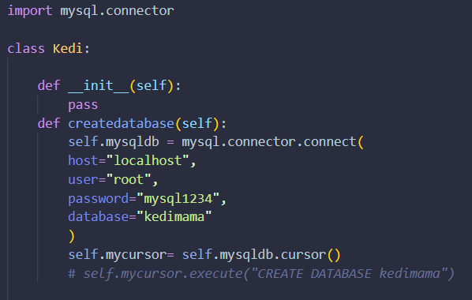
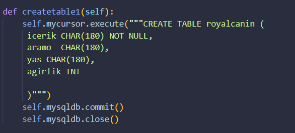
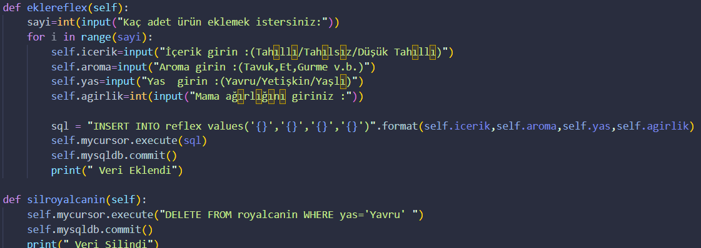
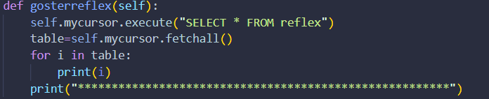
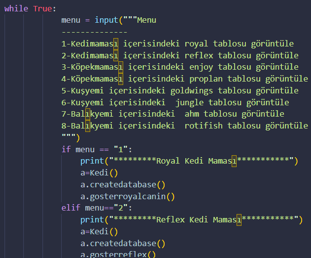

# The Aim Of This Project
In this project, four different databases and two tables were created in each of these databases.
 and It is intended to display these tables by taking input from the user.
 

# Create Databases
First, a class was created in Python and a database was created by defining a function in it.

# Create Table 
Then we created our tables by creating a function.

# Addition and Deletion Operations
We created two different functions to add and remove data from our tables.

# Show Table 
We created another function to see our data in the table.

# Finally
Finally, we created a menu with a while loop to receive input from the user.

# Contact
[LinkedIn](www.linkedin.com/in/damla-eraslan-bba35223a)
